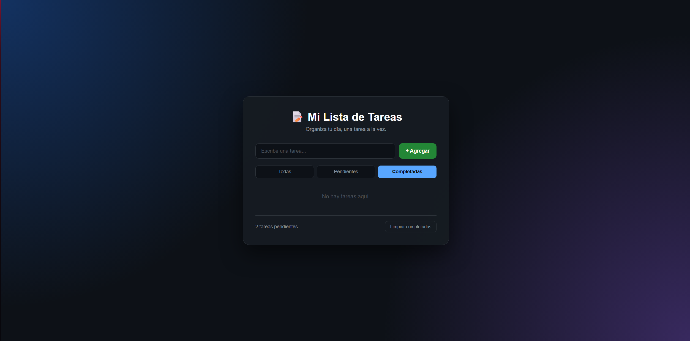

# To-Do List

Aplicación de tareas desarrollada con HTML, CSS y JavaScript puro.



## Ver en vivo

[samuellicht.github.io/to-do-list](https://samuellicht.github.io/to-do-list/)

## Funcionalidades

- Agregar tareas con el botón o presionando Enter
- Marcar tareas como completadas
- Eliminar tareas individualmente
- Filtrar por todas, pendientes y completadas
- Contador de tareas pendientes
- Limpiar todas las completadas de una vez
- Las tareas se guardan en localStorage

## Tecnologías usadas

- HTML5
- CSS3
- JavaScript

## Estructura del proyecto

```text
to-do-list/
│
├── index.html
├── styles.css
├── script.js
├── README.md
└── assets/
    └── img/
        └── preview.png


## Cómo ejecutar el proyecto

1. Clonar el repositorio:

```bash
git clone https://github.com/samuelLicht/to-do-list.git
```

2. Entrar a la carpeta:

```bash
cd to-do-list
```

3. Abrir `index.html` en el navegador.

## Autor

Samuel Licht — [@samuelLicht](https://github.com/samuelLicht)